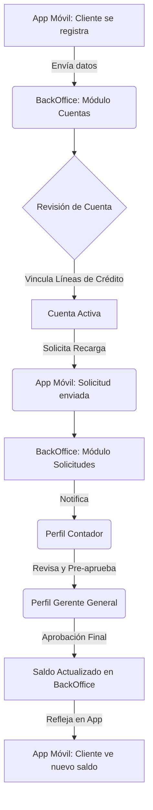

# Diagrama de Flujo: Operatoria de la Billetera

Este diagrama ilustra el flujo principal desde el registro del cliente (Onboarding), la gestión en el BackOffice, hasta el proceso de recarga de saldo con su respectiva aprobación.

